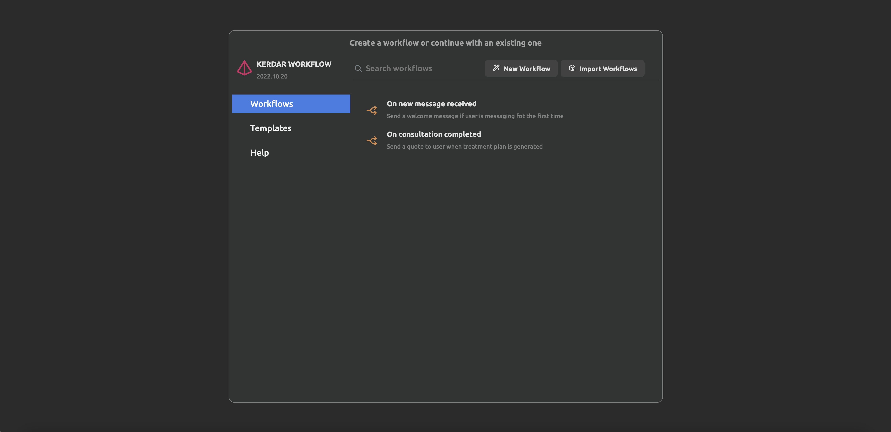
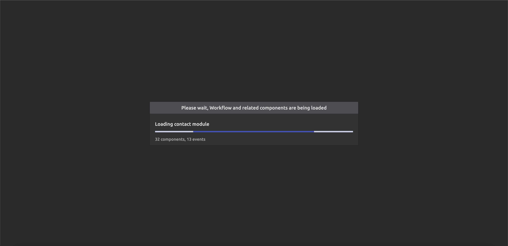
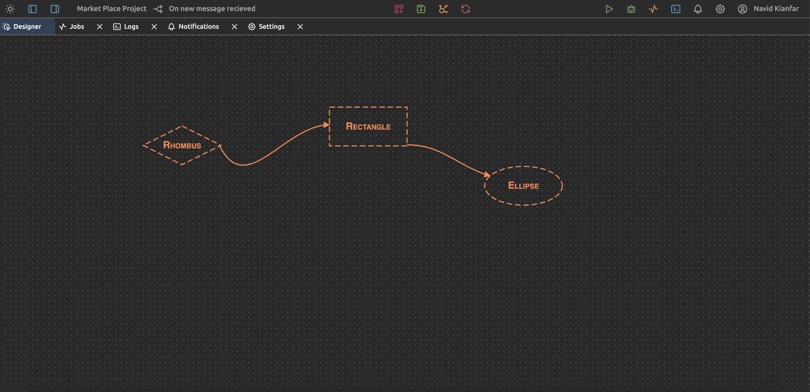
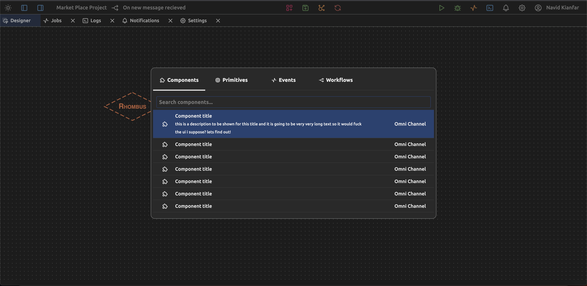

# Kerdar Workflow Designer UI

This workflow designer is not tied to any workflow engine and the ide behind it was to create a standard workflow designer that can be integrated to any workflow engine

for the ui/ux part i tried to get the idea from intellij platform since they are so amazing at what they are doing and i wanted to bring the beauty of jetbrain fleet to the workflow designer :D

here are some screenshots

